# Lab9Web

## Membuat Halaman Header, Footer dan About dengan php require 
Memasukkan command require pada index.php untuk header.php dan footer.php :
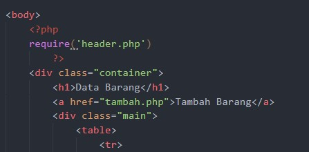
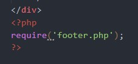

### Membuat Database di phpMyAdmin
Pertama - tama masuklah ke dalam phpMyAdmin, lalu buatlah database baru dengan nama "latihan1" :
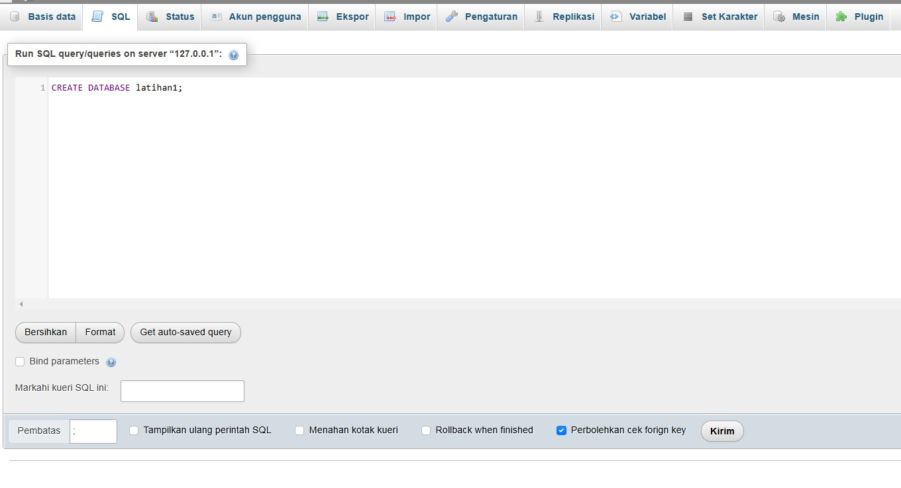
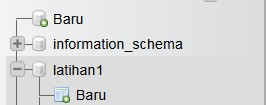

Lalu, Buatlah Tabel pada Database yang sudah kita buat, melalui menu "SQL" pada phpMyAdmin :
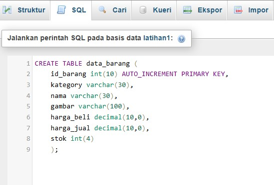
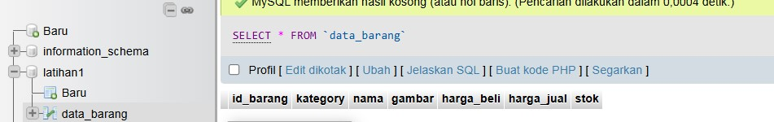

### Memasukkan Data pada Tabel melalui CMD
Kemudian, kita akan memasukkan data pada tabel yang sudah kita buat melalui CMD dengan menggunakan perintah SQL :
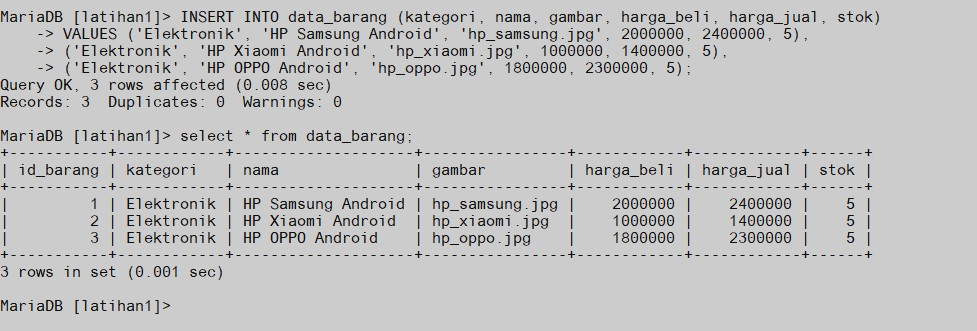

### Membuat PHP untuk Mengakses Database
Buatlah sebuah folder bernama "lab8_php_database" pada Folder htdocs dan buatlah file bernama koneksi.php :
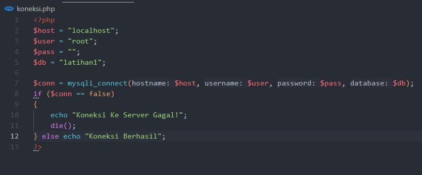
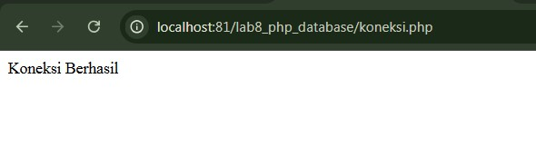

Lalu, buatlah file bernama index.php dan masukkan code seperti berikut :
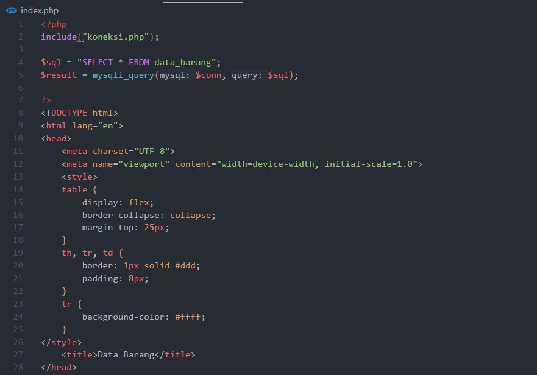
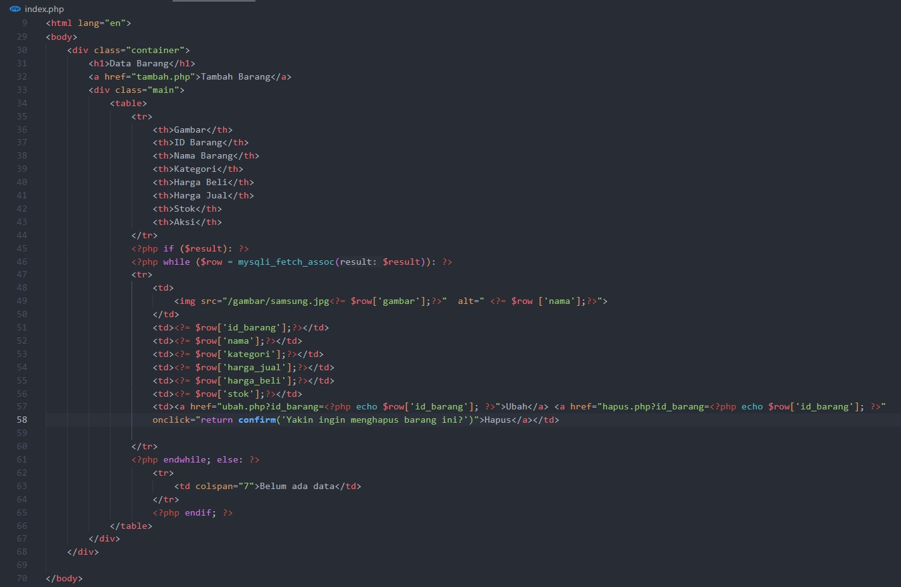
Dan berikut adalah tampilan dari sebuah halaman web yang sudah kita buat yang menampilkan beberapa data yang sudah kita buat :
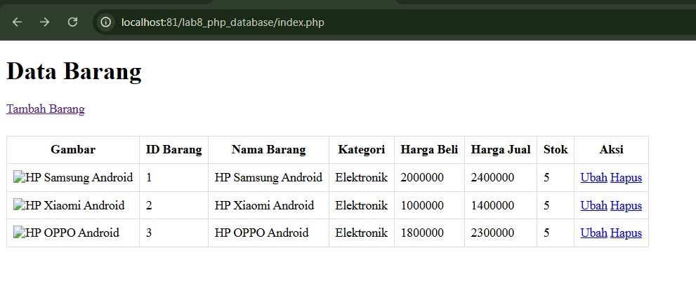

Kita akan membuat sebuah file bernama "tambah.php" untuk menambahkan data baru ke dalam database :
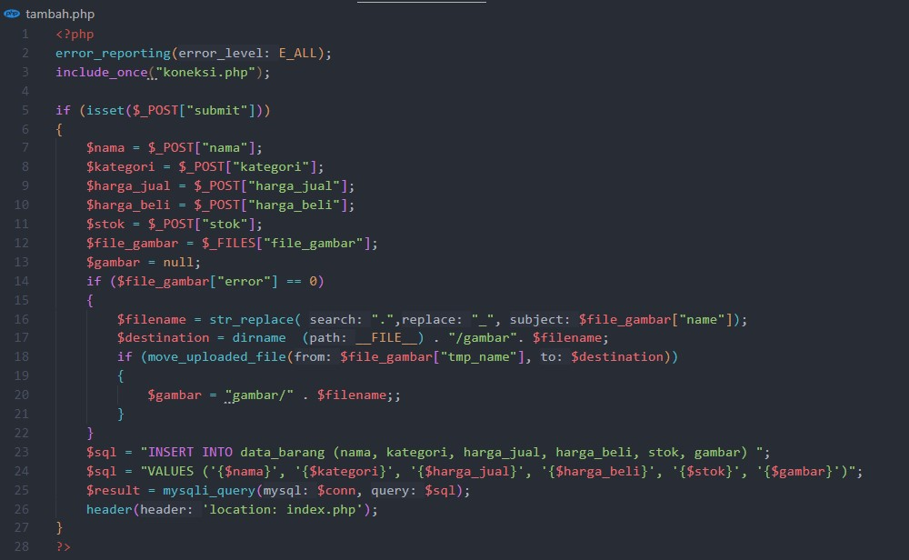
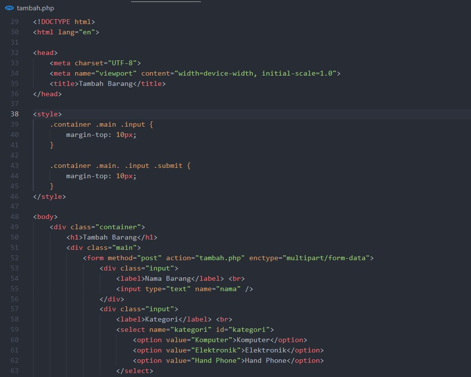
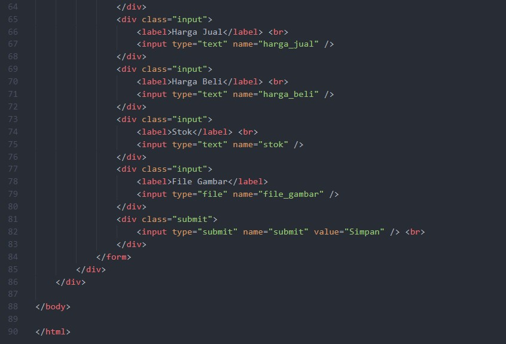
Berikut adalah tampilan untuk menambahkan barang :
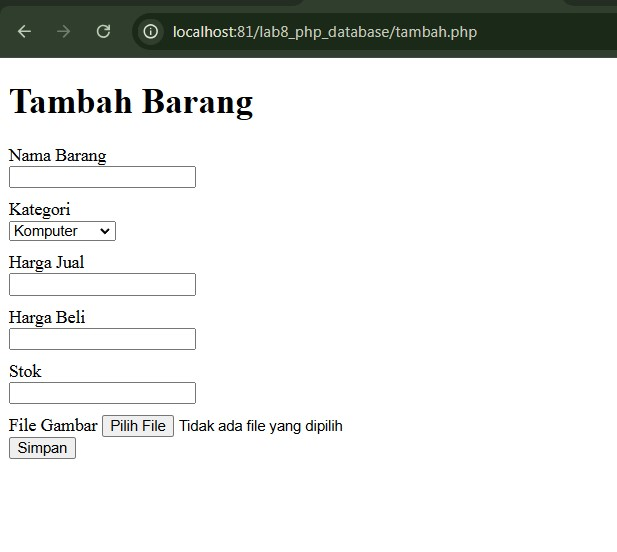

Dan berikut adalah tampilan untuk menampilkan data yang sudah kita tambahkan :
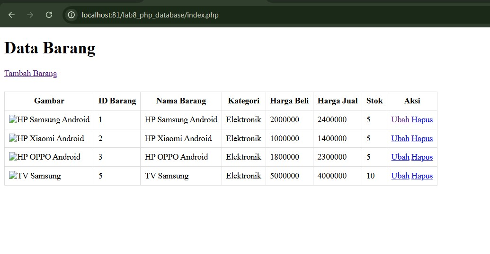

Lalu, setelah kita membuat file "tambah.php", kita akan membuat file "ubah.php" agar kita bisa lebih mudah untuk Mengedit sebuah data :
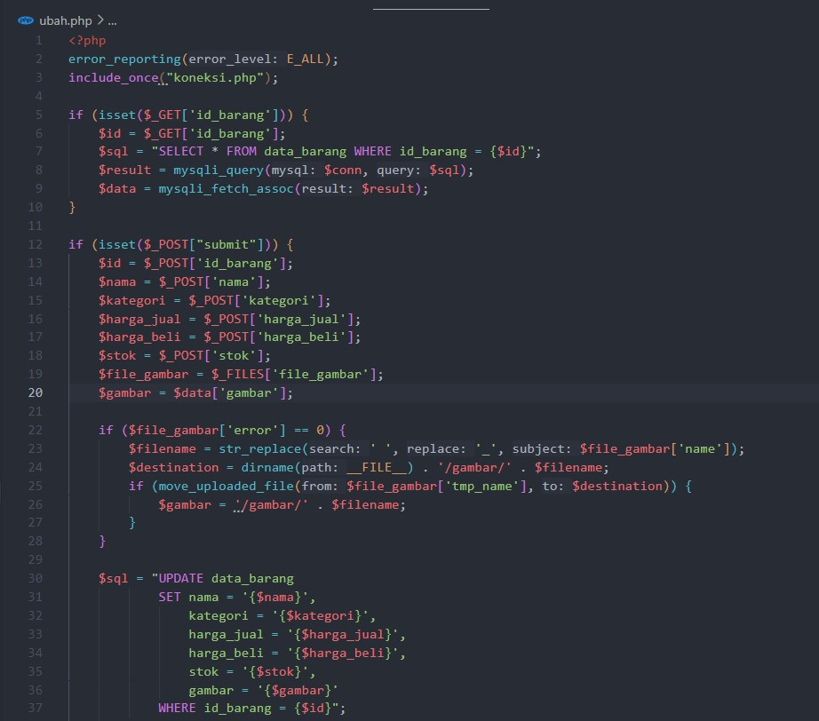
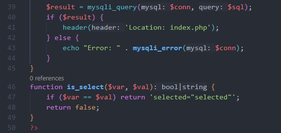
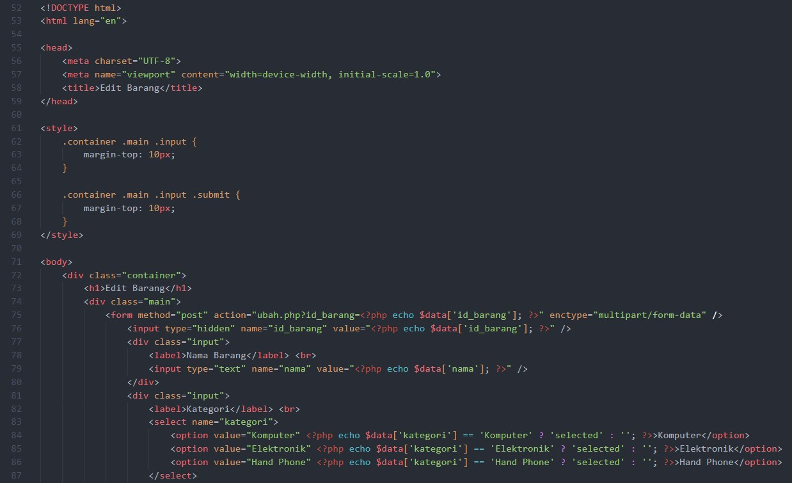
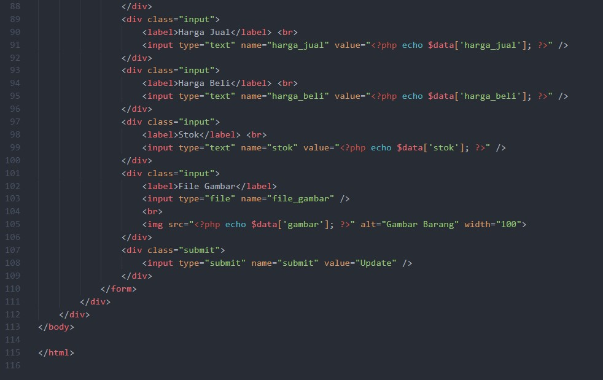
Berikut adalah tampilan untuk mengedit barang :
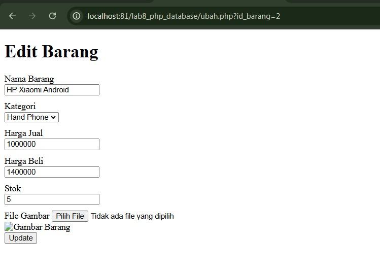

Dan berikut adalah tampilan untuk menampilkan data yang sudah kita edit (Disini saya mengedit pada bagian Kategori Hand Phone) :
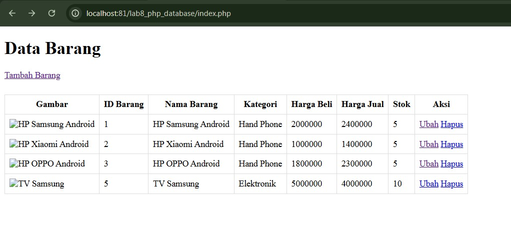

Lalu, kita akan membuat file "hapus.php" agar kita bisa menghapus sebuah data :
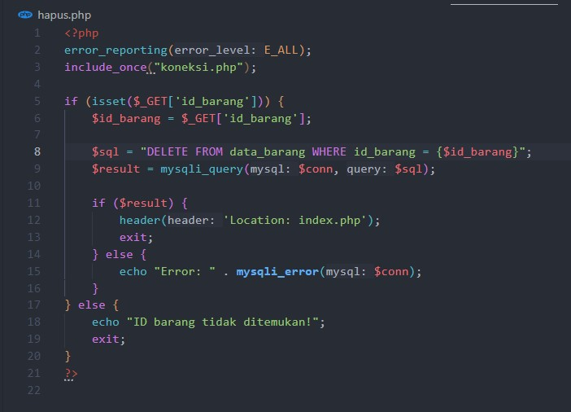

Dan pada bagian HTML kita mengubah pada file "index.php" pada bagian link untuk menghapus data :
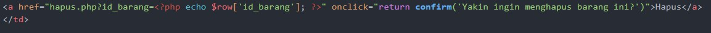
Berikut tampilan pada saat ingin menghapus data dan Hasil nya :
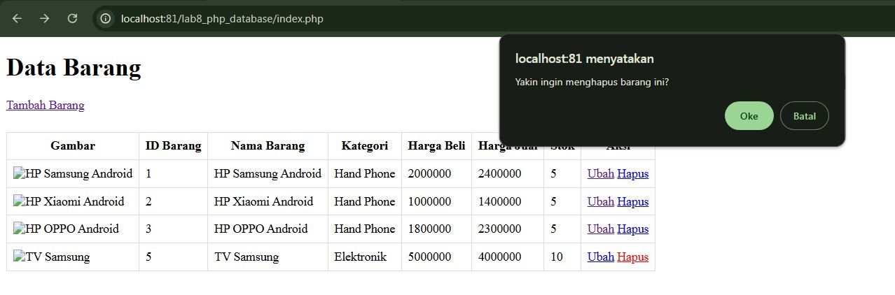
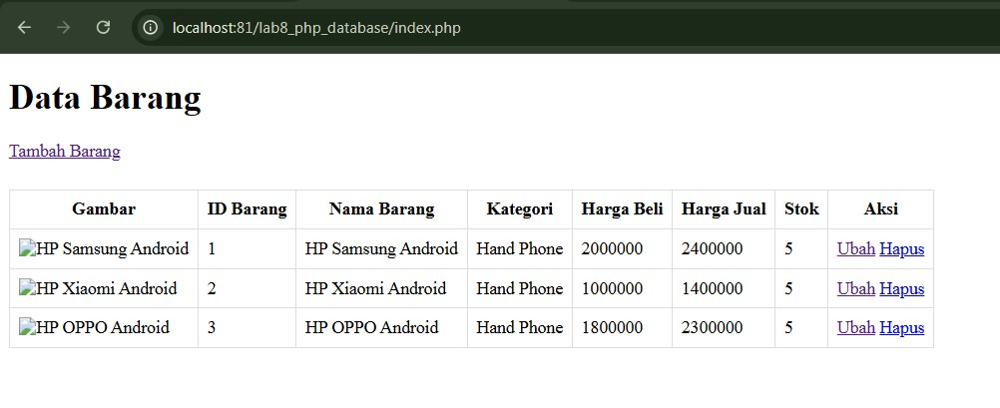

